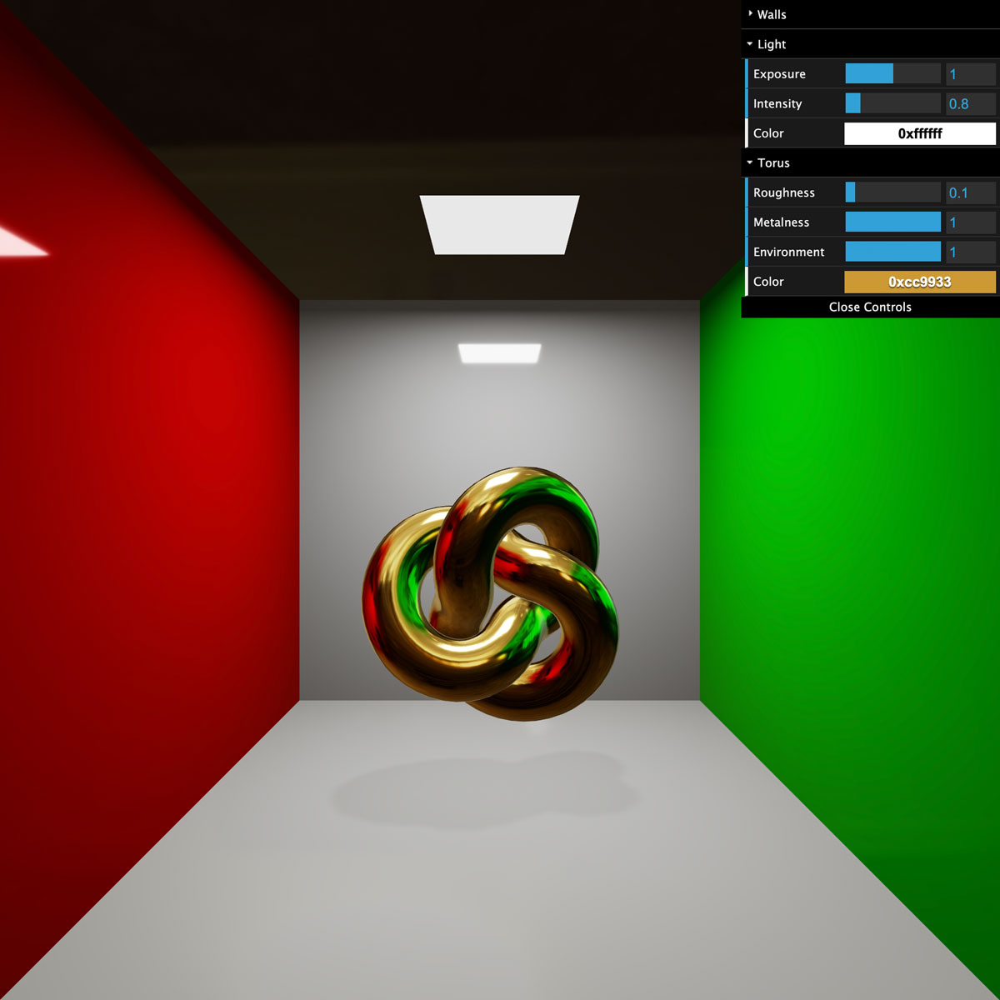

  

Cornell torus
========================================================================
This demo is part of my “Three.js in a Hurry” collection—an effort 
to help fellow spatial computing folks get up to speed quickly with 
the [Three.js](https://threejs.org/) WebGL-based 3D rendering library. 
This example contains a rotating 
[torus knot](https://en.wikipedia.org/wiki/Torus_knot) inside a 
[Cornell Box](https://en.wikipedia.org/wiki/Cornell_box) rendered live, 
complete with interactive controls for adjusting various parameters. 
The code is clean, commented, and contains links to relevant 
third-party documentation. This demonstration code is live at 
[http://stewartsmith.io/studies/cornell-torus/](http://stewartsmith.io/studies/cornell-torus/).  
  
  
How to: Download this code package
------------------------------------------------------------------------
If you’re not familiar with GitHub, the easiest way to download this
code package is to click the green “↓ Code” button near the top of this 
page. Choose the “Download ZIP” option.  
  
  
How to: Run this from your Mac desktop
------------------------------------------------------------------------
Sadly, you cannot just drag and drop the `index.html` file onto a 
browser window to view this application from your own 
[Macintosh](https://www.apple.com/macos/) desktop. You’ll need to spin
up a server and view the application from a URL like 
[http://localhost:8000/](http://localhost:8000/) instead. But don’t 
worry—that’s easy!  

1. Open the **Terminal** application. (Just hit ⌘ + Spacebar, then type
“terminal” to search for it on your Mac. Once found, hit Enter to open 
it.)

2. Type `cd `&nbsp;(yes, with that space after it), then drag and drop this
whole code package folder that you’ve downloaded onto the **Terminal** 
window—it will fill in the folder’s full path address for you. 
(You’ll see something like `cd ~/YourName/Downloads/cornell-torus/`.) 
Now hit Enter to tell **Terminal** it must `c`hange `d`irectories to 
that folder.

3. Paste this into **Terminal**, then hit Enter: 
`python -m SimpleHTTPServer 8000`. You are now running a web server on 
port `8000`. (You could instead use a different number to listen on a 
different port. This is handy if you need many servers running at once;
each will need to listen to a different port.)

4. Now you can visit this website at 
[http://localhost:8000](http://localhost:8000) and everything should be 
fine 👍  

When you’re ready to shut down the server, go back to **Terminal**  and
tap Control + C. That’s all!  
  
For more information on running a barebones local server, (including 
Python 3 commands) see Mozilla’s
[Set up a local testing server](https://developer.mozilla.org/en-US/docs/Learn/Common_questions/set_up_a_local_testing_server)
article.  
  
  
  
  